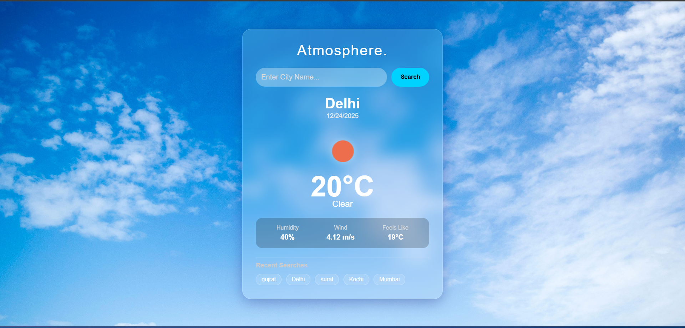
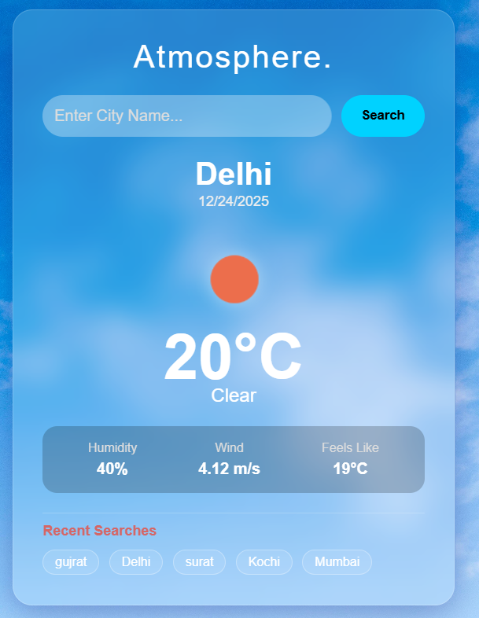

**🌦️ Weather App ( React + API )**

A modern and responsive Weather Application built using React that allows users to search weather details by city name and also shows recent searches. The app demonstrates real-world frontend concepts like API integration, state management, reusable components, and error handling.

**🚀 Features**

🔍 Search weather by city name
🌡️ Displays temperature, weather condition, humidity & wind speed
🕘 Recent searched cities (stored using localStorage)
📍 Auto weather detection using browser location (if allowed)
⏳ Loader while fetching data
❌ Proper error handling (invalid city / network issue)
📱 Fully responsive UI

**🛠️ Tech Stack**

- React
- JavaScript (ES6+)
- CSS
- OpenWeatherMap API
- Browser APIs (Geolocation, localStorage)

  ## 📸 Screenshots

  ### 🏠 Home Result

### 🔍 Search Weather

### 🌦️ Weather Details

### 🕘 Recent Searches

**How to Run Locally**

- Clone the repository git clone https://github.com/PrernaSingh-90/weather-app.git
- Install dependencies npm install
- Start the project npm run dev

**📚 Learning Outcomes**

- API integration using fetch
- React state & props management
- Reusable components
- Handling loading & error states
- Using browser APIs (Geolocation, localStorage)
- Clean and scalable component structure

**  👩‍💻 Author**
Prerna 
Frontend Developer
